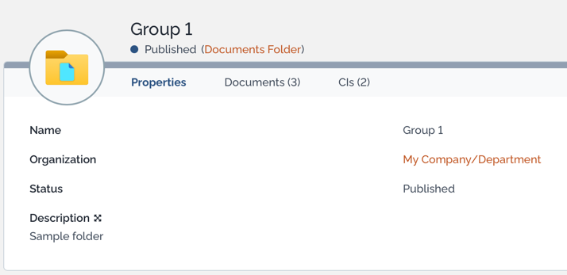

#  Documents folder

The module `sv-documents-folder` is an [iTop](https://www.combodo.com/itop-193) extension to add a folder hierarchy to documents.

## Installation

Place this in the `extensions` folder of your iTop instance and run iTop setup again.
Be sure to enable the extension during setup.

## Preview

