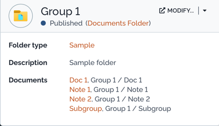
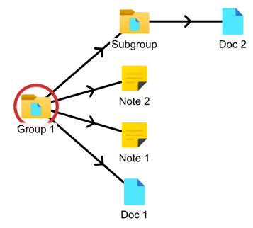

# Documents folder

The module `sv-documents-folder` is an [iTop](https://www.combodo.com/itop-193) extension to add a folder hierarchy to documents.

## Installation

Place this in the `extensions` folder of your iTop instance and run iTop setup again.
Be sure to enable the extension during setup.

## Preview

### Details view

### Summary card

When hovering on a link to a Documents Folder, iTop will show this summary card:

This extension also adds a summary card for other types of documents:

### Relation view

In the actions menu of a Documents Folder, you can choose to view a relation of all documents contained in it.

